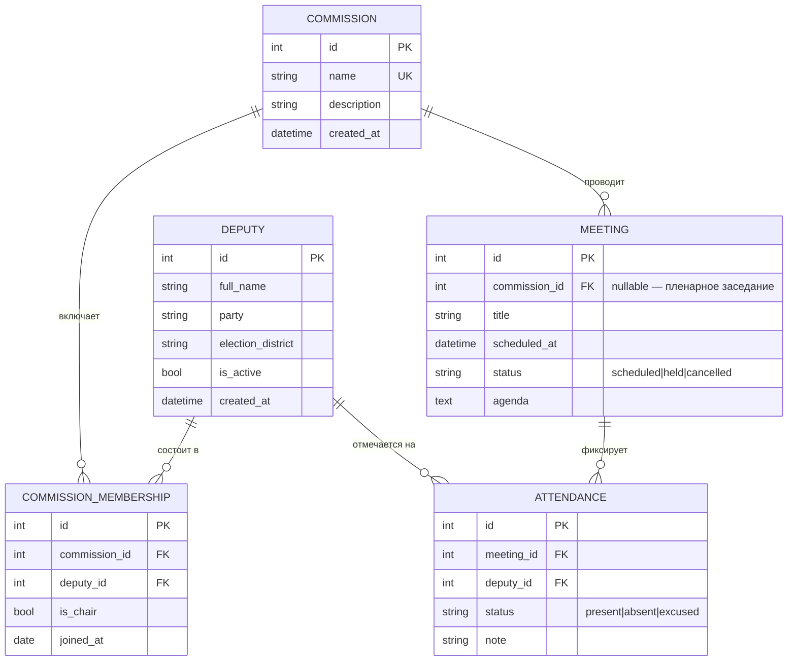

# Схема данных

## Ключевые ограничения
- `COMMISSION.name` — уникально.
- `COMMISSION_MEMBERSHIP` — уникальная пара `(commission_id, deputy_id)`.
- `ATTENDANCE` — уникальная пара `(meeting_id, deputy_id)`.
- Председатель (`is_chair = true`) — не более одного на комиссию
  (проверяется на уровне приложения, см. `app/crud.py::add_membership`).
- Внешние ключи — `ON DELETE CASCADE`: удаление депутата/комиссии удаляет
  зависимые членства, заседания и посещаемость.

## Управление схемой
Схема версионируется миграциями Alembic (`alembic/versions/`). Первая
миграция создаёт все пять таблиц. Применение: `make migrate`.
